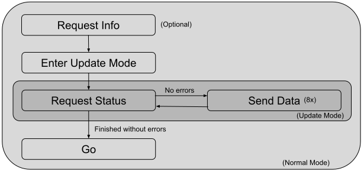

# BootloaderLIN_STM8

A bootloader over LIN for STM8S003F3.

Tools: IAR 3.11.1

### Usage
1.  Generate a .hex of the bootloader (remember to use the provided linker file).
2.  Point the interruptions to the app (need to modify bootloader binary file). For that, use the instructions in genBootloader folder.
3.  Flash bootloader to stm8s: use STVP and ST-LINK.
4.  Build an app and remember to place it in the correct flash section.
5.  Send the firmware respecting the frames and timing rules described in this file.

### Introduction
The bootloader will answer to frames sent to IDs 0x30 (to send data to bootloader) and 0x31 (to request data from bootloader).

Is important to say that only a single device of a LIN network can be updated at a time. That’s because the protocol uses a fixed destination address and a handshake protocol during update. So, if more than one device in the network is in bootloader mode, it will be considered an invalid scenario and unpredicted effects can happen. 

The UART settings: 19200bps, 8 data bits, one stop bit.

### The bootloader has two operation modes:

Normal mode: in this mode the bootloader will accept a wider range of commands (sent in any order) and can reply some data. A special command can make the bootloader enter in Update Mode.

Update mode: in this mode the bootloader only accepts the pieces of the new firmware. After receiving all the firmware file, it will automatically return to normal mode.

### Normal Mode
It is the default bootloader mode. The valid frames for this mode are “Request Status”, “Enter Update Mode” and “Go”. They are described below:

#### Request Status
This command sends the status and some information back to master. The frame format is listed below:
|Field				|Size (Bytes)      |Value         	 			|Description 			|
|--   				|--         	   |--             				|--          			|
|PID  				|1                 |0xB1 (ID: 0x31)				|PID of frame			|
|Error Code 	    |1                 |See Section "Error Codes"	|Module status		    |
|FW Version 	    |1                 |Any							|FW Version			    |
|Boot Version       |1                 |Any							|Bootloader Version     |
|RFFU			 	|1                 |0x00						|Reserved				|
|Checksum 	        |1                 |Any							|Checksum				|

In the frame listed above, only the PID is sent from master.

#### Enter Update Mode
Inform that a firmware update will start. On success, the bootloader will switch to Update Mode, see Section “Update Mode”.
|Field				|Size (Bytes) |Value         	|Description 			                    |
|--   				|--           |--             	|--          			                    |
|PID  				|1            |0xF0 (ID: 0x30)	|PID of frame			                    |
|Command	 	    |1            |'U' 0x55			|Code to Update Mode                        |
|Number of Blocks   |1            |6 to 98			|Number of 64 bytes blocks of the firmware  |
|CRC 				|1            |Any				|CRC of firmware	                        |
|RFFU			 	|1            |0x00				|Reserved				                    |
|Checksum 	        |1            |Any				|Checksum				                    |

#### Go
Inform bootloader to jump to the main application. Important: The only way of exiting bootloader mode is through this command, it will not exit by timeout or by a hard reset.
|Field		|Size (Bytes) |Value         	|Description 			|
|--   		|--           |--             	|--          			|
|PID  		|1            |0xF0 (ID: 0x30)	|PID of frame			|
|Command	|1            |'G' 0x47			|Code to "Go" cmd       |
|RFFU		|1            |0x00				|Reserved				|
|Checksum 	|1            |Any				|Checksum				|

To avoid jumps to invalid applications, a CRC check is performed before jumping. The CRC of flashed applications need to match the one received in the last “Enter Update Mode” frame.

### Update Mode
This mode is activated after sending a special frame during Normal Mode. This mode only accepts firmware pieces and status requests to check on update progress. Be aware that these frames need to be sent respecting an exact order (see Section “Update Process”). The accepted frames are described below:

#### Request status

Return the update status. Note that this is the same frame that the master sends in Normal Mode, but in this mode, less data is returned (only the status).

|Field			|Size (Bytes) |Value         	 			|Description 			|
|--   			|--           |--             				|--          			|
|PID  			|1            |0xB1 (ID: 0x31)				|PID of frame			|
|Error Code 	|1            |See Section "Error Codes"	|Update Status		    |
|RFFU			|1            |0x00							|Reserved				|
|Checksum 	    |1            |Any							|Checksum				|

A delay of 12ms need to be respected before asking the module status. An exception is when requesting the last status frame (after sending the last firmware piece), in this specific case  a delay of 65ms need to be respected.

#### Firmware Piece
Sends a piece of the firmware in the payload.
|Field		|Size (Bytes)   |Value         	 |Description 			|
|--   		|--         	|--              |--          			|
|PID  		|1              |0xF0 (ID: 0x30) |PID of frame			|
|Data		|8              |Any			 |Firmware				|
|Checksum 	|1              |Any			 |Checksum				|

### Update Process
The sequence of frames for a complete update is listed in the figure below. It is mandatory that before  sending 64 bytes of data, the status is read and informs no errors.

```

```


### Data Integrity

To keep data integrity, beyond the checksum of the LIN protocol in each frame (including the PID, as specified in LIN 2.0), a CRC-8-CCIT is computed over the firmware file.

After sending all the firmware file, the status should be requested one last time to check if the CRC matched the received one. A delay of 65ms need to be respected before asking for the last status, that’s because of the CRC check on the entire flashed firmware.

### Error Codes

During bootloader operation, it can inform some errors. To read these errors, use the status request frame (ID: 0x31).  The error will be cleared  after a status request. The table below shows the meaning of reported errors.
|Value|Description          |
|-----|-----------          |
|0xA0 |No errors            |
|0xF1 |Header Error         |
|0xF2 |Invalid file size    |
|0xF3 |Wrong checksum       |
|0xF4 |Wrong CRC            |
|0xF5 |Wrong command        |

### Final Considerations

The firmware can be updated in a total of 8 seconds.

I would like to thank the owners of the following repos:
[HairBoot from Zepan](https://github.com/Zepan/hairBoot)

[Lujji's Bootloader](https://github.com/lujji/stm8-bootloader)

[Ethan's Bootloader](https://github.com/ccyinlu/stm8l-bootloader)
